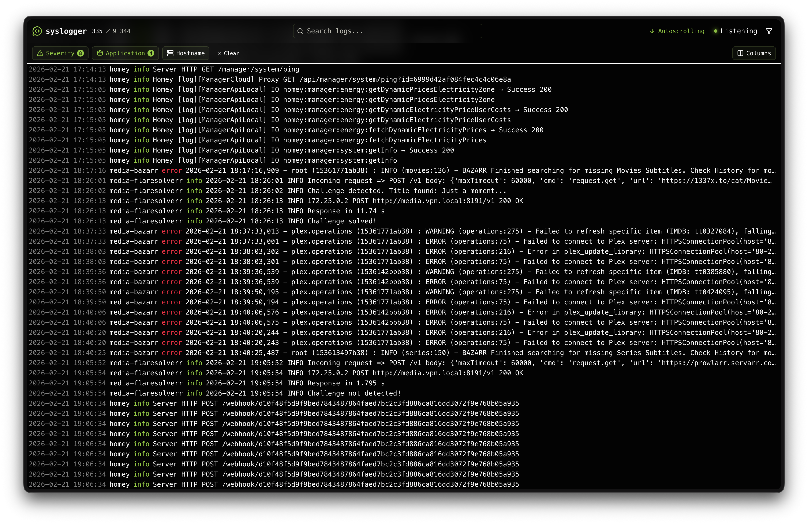

<div align="center">
  
  
  **Real-time Syslog Management System**
  
  A modern, high-performance syslog server with beautiful real-time monitoring and powerful filtering.
  
  [](https://github.com/kalleruud/syslogger/actions/workflows/build-image.yml)
  [](https://github.com/kalleruud/syslogger/blob/main/docker-compose.yml)
  
   [Features](#-features) • [Quick Start](#-quick-start) • [Roadmap](#️-roadmap) • [Docker](#-docker-deployment) • [Development](#development)
</div>

<div align="center">
  
  <br>
  <i>Terminal-inspired interface with real-time log streaming, filtering, and search</i>
</div>

## ✨ Overview

**Syslogger** is a full-stack syslog management system built for speed and simplicity. It receives syslog messages via UDP, parses them intelligently, stores them in SQLite, and streams them to a beautiful terminal-inspired web interface in real-time using WebSockets.

### Why Syslogger?

- 🚀 **Blazingly Fast** - Built on Bun runtime with optimized SQLite queries
- 🎨 **Beautiful UI** - Terminal-inspired design with real-time updates
- 🔍 **Powerful Filtering** - Multi-select filters for severity, hostname, and application
- 📡 **Real-time Streaming** - WebSocket-powered live log updates
- 🐳 **Docker Ready** - Production-ready Docker setup with health checks
- 🛠️ **Type-Safe** - Full TypeScript coverage with Drizzle ORM
- 📱 **PWA Support** - Install as a native app on mobile devices

## 🎯 Features

### Syslog Reception & Parsing

- [x] **Real-time UDP Reception**: Listen for syslog messages on port 5140 (configurable)
- [ ] **RFC 5424 Support**: Parse modern structured syslog format
- [x] **RFC 3164 Support**: Parse legacy BSD syslog format
- [x] **Docker-friendly Parsing**: Handle containerized logs without hostname field
- [x] **Automatic Severity Detection**: Fallback regex-based severity extraction from message text
- [x] **Complete Field Extraction**: Facility, severity, timestamp, hostname, appname, procid, msgid, and message

### Database & Storage

- [x] **SQLite with Drizzle ORM**: Type-safe database operations with zero runtime overhead
- [x] **Automatic Migrations**: Database schema managed via Drizzle-kit
- [x] **Performance Indexes**: Optimized queries with indexes on timestamp, severity, hostname, and appname
- [x] **WAL Mode**: Write-Ahead Logging for better concurrency
- [x] **Raw Message Storage**: Original syslog messages preserved for debugging

### Real-time Features

- [x] **WebSocket Streaming**: Instant log delivery to all connected clients using bun websockets
- [x] **Auto-reconnect**: Automatic websocket reconnection
- [x] **Connection Status Indicator**: Visual feedback with pulse animation

### Filtering & Search

- [x] **Full-text Search**: Search across message, appname, and hostname fields (300ms debounce)
- [x] **Severity Multi-select**: Filter by any combination of severity levels (0-7)
- [x] **Application Multi-select**: Filter by dynamically-loaded application names
- [x] **Hostname Filtering**: Filter by exact hostname match
- [x] **URL Parameter Persistence**: Filters all saved in URL for bookmarking and sharing
- [x] **Browser History Support**: Back/forward navigation works with filters

### User Interface

- [x] **Single Page Application**: Minimal, terminal-inspired design on a single page
- [x] **Top Control Bar**: Search input, filter dropdowns, column visibility toggle, and settings button in one row
- [x] **Terminal-style Log Table**: Fixed-width character columns with no gaps or margins between cells
- [x] **Column Visibility Toggle**: Show/hide columns via multi-select dropdown
- [ ] **Settings Button**: Opens a popup to configure retention settings per severity level
- [x] **Severity Color Coding**: Visual distinction by log level (red/orange/yellow/blue)
- [x] **Virtual Scrolling**: Efficient rendering of large datasets with @tanstack/react-virtual
- [x] **Infinite Scroll**: Load older logs automatically when scrolling up
- [x] **Auto scroll**: When the screen is scrolled all the way to the bottom, auto scrolling on new incoming logs is enabled.

### Log Detail Panel

- [ ] **Click-to-inspect**: Click any row to open the detail panel below the top bar
- [ ] **Non-blocking**: Log table remains fully interactable while the detail panel is open
- [ ] **Full Field Display**: All syslog fields with human-readable labels
- [ ] **Facility Names**: Numeric facilities shown as readable names (kernel, user, mail, daemon, etc.)
- [ ] **Raw Message View**: Original unparsed syslog message

### Log Retention

- [ ] **Settings Popup**: Adjust retention days per severity via the settings button in the UI
- [ ] **Per-Severity Retention**: Configure retention period (in days) for each severity level independently
- [ ] **Persistent Configuration**: Settings stored in `config.json` and persist across restarts
- [ ] **Automatic Cleanup**: Daily cleanup job removes old logs

### Deployment

- [x] **Docker Deployment**: Multi-stage Dockerfile with optimized builds
- [x] **Docker Compose**: Complete orchestration with health checks and resource limits
- [x] **Volume Persistence**: SQLite database persisted via Docker volumes
- [x] **Static File Serving**: Backend serves compiled frontend
- [x] **SPA Routing**: Proper handling of client-side routes
- [x] **CORS Support**: Configurable cross-origin requests
- [x] **Graceful Shutdown**: Clean database and socket cleanup
- [x] **Health Checks**: Built-in HTTP health monitoring

## Architecture

```
┌───────────────────────────────────────────┐
│         Syslog Devices (UDP)              │
└────────────────┬──────────────────────────┘
                 │
                 ▼
┌───────────────────────────────────────────┐
│    Backend (Bun/TypeScript)               │
│  ┌─────────────────────────────────────┐  │
│  │ Syslog Receiver (UDP 5140)          │  │
│  │ Syslog Parser (RFC 5424/3164)       │  │
│  │ SQLite + Drizzle ORM + WAL          │  │
│  │ Advanced query functions            │  │
│  │ WebSocket Server (Pub/Sub)          │  │
│  │ Docker deployment                   │  │
│  │ REST API routes                     │  │
│  │ Settings API (config.json)          │  │
│  │ Log Retention Cleanup               │  │
│  │ Bun.serve for fullstack             │  │
│  └─────────────────────────────────────┘  │
└────────────────┬──────────────────────────┘
                 │
                 ▼
┌───────────────────────────────────────────┐
│    Frontend (React 19 + Bun)              │
│  ┌─────────────────────────────────────┐  │
│  │ Minimal terminal-style UI           │  │
│  │ Top bar: search, filters, etc       │  │
│  │ Settings popup for retention        │  │
│  │ Log table with virtual scroll       │  │
│  │ Click-to-inspect detail panel       │  │
│  │ WebSocket Client (auto-reconnect)   │  │
│  │ URL-synced filter state             │  │
│  └─────────────────────────────────────┘  │
└───────────────────────────────────────────┘

Legend: ✓ Complete | - In Progress | x Not Started
```

### Retention Settings

Retention settings will be managed via `src/lib/config.ts` and configurable via the settings popup in the UI:

```json
{
  "retention": {
    "0": null, // Emergency - keep forever (null = no expiry)
    "1": null, // Alert - keep forever
    "2": null, // Critical - keep forever
    "3": 90, // Error - 90 days
    "4": 60, // Warning - 60 days
    "5": 30, // Notice - 30 days
    "6": 14, // Info - 14 days
    "7": 7 // Debug - 7 days
  }
}
```

Set a severity to `null` to keep logs of that level indefinitely.

> **Note**: Retention cleanup is not yet implemented.

## API Endpoints

The following REST API endpoints are planned but not yet implemented:

### GET /api/logs

Fetch logs with optional filtering and pagination.

**Query Parameters:**

- `limit` (default: 100) - Maximum number of logs to return
- `offset` (default: 0) - Skip first N logs
- `severity` - Comma-separated severity levels (e.g., `0,1,2,3`)
- `hostname` - Filter by exact hostname
- `appname` - Comma-separated application names (e.g., `nginx,sshd`)
- `search` - Full-text search in message, appname, and hostname

**Note**: Database query functions for these filters are implemented in `src/database/queries.ts`.

---

<div align="center">
  <sub>Built with ❤️ using Bun, React, and TypeScript</sub>
  <br>
  <sub>⭐ Star this repo if you find it useful!</sub>
</div>
